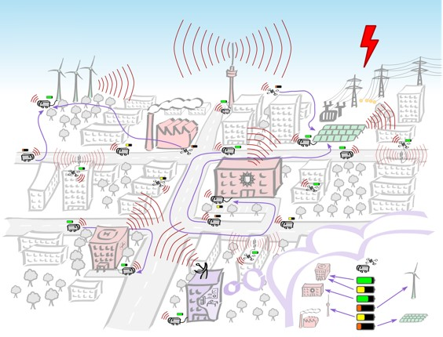

<!--
*** Thanks for checking out this README Template. If you have a suggestion that would
*** make this better, please fork the repo and create a pull request or simply open
*** an issue with the tag "enhancement".
*** Thanks again! Now go create something AMAZING! :D
-->


<!-- PROJECT SHIELDS -->
<!--
*** I'm using markdown "reference style" links for readability.
*** Reference links are enclosed in brackets [ ] instead of parentheses ( ).
*** See the bottom of this document for the declaration of the reference variables
*** for contributors-url, forks-url, etc. This is an optional, concise syntax you may use.
*** https://www.markdownguide.org/basic-syntax/#reference-style-links
-->
[![Contributors][contributors-shield]][contributors-url]
[![Forks][forks-shield]][forks-url]
[![Stargazers][stars-shield]][stars-url]
[![Issues][issues-shield]][issues-url]
[![MIT License][license-shield]][license-url]
[![LinkedIn][linkedin-shield]][linkedin-url]


<!-- PROJECT LOGO -->
<br />
<p align="center">
  <a href="https://github.com/PhilippBrendel/bevrp">
    
  </a>

  <h3 align="center">BEVRP</h3>

  <p align="center">
    The Bidirectional Vehicle Routing Problem
    <br />
    <a href="https://github.com/PhilippBrendel/bevrp"><strong>Explore the docs »</strong></a>
    <br />
    <br />
    <a href="https://github.com/PhilippBrendel/bevrp">View Demo</a>
    ·
    <a href="https://github.com/PhilippBrendel/bevrp/issues">Report Bug</a>
    ·
    <a href="https://github.com/PhilippBrendel/bevrp/issues">Request Feature</a>
  </p>
</p>


<!-- TABLE OF CONTENTS -->
## Table of Contents

* [About the Project](#about-the-project)
  * [Built With](#built-with)
* [Getting Started](#getting-started)
  * [Prerequisites](#prerequisites)
  * [Installation](#installation)
* [Usage](#usage)
* [Roadmap](#roadmap)
* [Contributing](#contributing)
* [License](#license)
* [Contact](#contact)
* [Acknowledgements](#acknowledgements)


<!-- ABOUT THE PROJECT -->
## About The Project

[![Product Name Screen Shot][product-screenshot]](https://example.com)

This project provides code to solve the bidirectional routing problem.
The direct implementation as well as a greedy heuristic Greedy-2.

Includes:
* [smart_krit.py](https://github.com/PhilippBrendel/bevrp/blob/main/smart_krit.py): solve BEVRP directly using Gurobi
* [greedy.py](https://github.com/PhilippBrendel/bevrp/blob/main/greedy.py): implementation of Greedy-2 heuristic
* [visualizers.py](https://github.com/PhilippBrendel/bevrp/blob/main/visualizers.py): tools to visualize solutions :smile:
* [utils.py](https://github.com/PhilippBrendel/bevrp/blob/main/utils.py): helper function in various stages of the above
* [pypeline.py](https://github.com/PhilippBrendel/bevrp/blob/main/pypeline.py): useful automization script to solve many instances 
* [config.yaml](https://github.com/PhilippBrendel/bevrp/blob/main/config.yaml): exemplary config-file
* exemplary data containing energy consumers, producers and vehicles


<!--
### Built With
This section should list any major frameworks that you built your project using. Leave any add-ons/plugins for the acknowledgements section. Here are a few examples.
* [Bootstrap](https://getbootstrap.com)
* [JQuery](https://jquery.com)
* [Laravel](https://laravel.com)
-->


<!-- GETTING STARTED -->
## Getting Started

Just set up a gurobi licence, anaconda and go.

### Prerequisites

* [Gurobi licence](https://www.gurobi.com/)

* [Anaconda](https://www.anaconda.com/)


### Installation

<!-- 1. Get a free API Key at [https://example.com](https://example.com) -->
1. Clone the repo
```sh
git clone https://github.com/PhilippBrendel/bevrp.git
```
2. Create Conda environmemt via provided yml-file
```sh
conda env create -f bevrp.yml
```
3. Install Gurobi licence
```sh
grbgetkey xxxxxxxx-xxxx...
```
<!--4. Enter your API in `config.js`
```JS
const API_KEY = 'ENTER YOUR API';
```
-->


<!-- USAGE EXAMPLES -->
## Usage

TODO

_For more examples, please refer to the [Documentation](https://example.com)_


<!-- ROADMAP -->
## Roadmap

See the [open issues](https://github.com/PhilippBrendel/bevrp/issues) for a list of proposed features (and known issues).


<!-- CONTRIBUTING -->
## Contributing

Contributions are what make the open source community such an amazing place to be learn, inspire, and create. Any contributions you make are **greatly appreciated**.

1. Fork the Project
2. Create your Feature Branch (`git checkout -b feature/AmazingFeature`)
3. Commit your Changes (`git commit -m 'Add some AmazingFeature'`)
4. Push to the Branch (`git push origin feature/AmazingFeature`)
5. Open a Pull Request


<!-- LICENSE -->
## License

TODO. See `LICENSE` for more information.


<!-- CONTACT -->
## Contact

Philipp Brendel - philipp.brendel@iisb.fraunhofer.de - philipp.brendel@fau.de

Project Link: [https://github.com/PhilippBrendel/bevrp](https://github.com/PhilippBrendel/bevrp)


<!-- ACKNOWLEDGEMENTS -->
## Acknowledgements
* [Gurobi](https://www.gurobi.com/)
* [Anaconda](https://www.anaconda.com/)
* [Conda Cheat Sheet](https://docs.conda.io/projects/conda/en/4.6.0/_downloads/52a95608c49671267e40c689e0bc00ca/conda-cheatsheet.pdf)


<!-- MARKDOWN LINKS & IMAGES -->
<!-- https://www.markdownguide.org/basic-syntax/#reference-style-links -->
[contributors-shield]: https://img.shields.io/github/contributors/philippbrendel/bevrp.svg?style=flat-square
[contributors-url]: https://github.com/philippbrendel/bevrp/graphs/contributors
[forks-shield]: https://img.shields.io/github/forks/philippbrendel/bevrp.svg?style=flat-square
[forks-url]: https://github.com/philippbrendel/bevrp/network/members
[stars-shield]: https://img.shields.io/github/stars/philippbrendel/bevrp.svg?style=flat-square
[stars-url]: https://github.com/philippbrendel/bevrp/stargazers
[issues-shield]: https://img.shields.io/github/issues/philippbrendel/bevrp.svg?style=flat-square
[issues-url]: https://github.com/philippbrendel/bevrp/issues
[license-shield]: https://img.shields.io/github/license/philippbrendel/bevrp.svg?style=flat-square
[license-url]: https://github.com/philippbrendel/bevrp/blob/master/LICENSE.txt
[linkedin-shield]: https://img.shields.io/badge/-LinkedIn-black.svg?style=flat-square&logo=linkedin&colorB=555
[linkedin-url]: https://www.linkedin.com/in/philipp-brendel-9059171a6/
[product-screenshot]: images/smart_krit.jpg